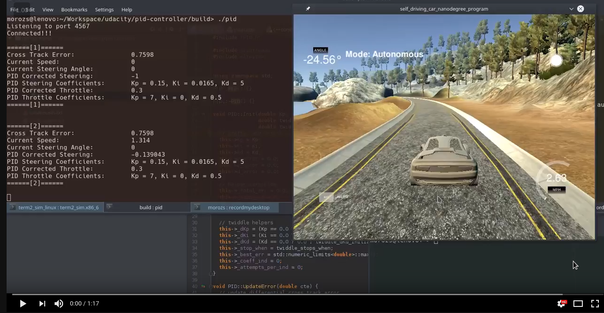

## PID Controller (Self-Driving Car Engineer Nanodegree)

In this project, a PID controller is utilized to control the steering angle and throttle of the car in the simulator.

This project involves the Udacity Self-Driving Car Engineer Nanodegree Term 2 Simulator which can be downloaded from [here](https://github.com/udacity/self-driving-car-sim/releases).


#### Dependencies

* cmake >= 3.5
* make >= 4.1 (Linux, Mac), 3.81 (Windows)
* gcc/g++ >= 5.4
* [uWebSocketIO](https://github.com/uWebSockets/uWebSockets) with commit hash e94b6e1


#### Build
The PID controller program can be built and run by doing the following from the project top directory.

```bash
$> mkdir build
$> cd build
$> cmake ..
$> make
```


#### Run
Run from the project top directory.
```bash
$> build/pid
```


#### Demo


[](https://youtu.be/vs8lae_L3XY)


#### Description
The vehicle is controlled by two PID controllers. One of them takes the cross track error as an input and produces the correcting steering angle, while another one takes as an input maximum between absolute values of the cross track error and the steering angle and produces the throttle value. The latter should be responsive to changes of the parameters it depends on since it is reasonable to decrease speed either when the steering angle is steep or when there is a considerable cross track error. 

**P** - the proportional component of the PID controller. It steers the car along to road center, reference line. The larger the corresponding coefficient (parameter of the PID controller) the steeper steering angles. When this component used alone, the car starts to oscillate, and the oscillation amplitude increases with the time until, finally, the car crashes or leaves the road.

**I** - the integral component of the PID controller. It is responsible for compensating the bias that the car's steering wheel might have. When this component used alone, the car leaves the road and starts the circular motion. 

**D** - the differential component of the PID controller. It is responsible for smoothing the car's oscillations around the reference line. It compensates the steering angle when the car approaches the center of the road. When this component used alone, the car is irresponsive to the road steepness and reacts only to little changes in the steepness. The car leaves the road as soon as the steep enough turn occurs.


#### Parameter Tuning
Initially, the throttle was constant, and the parameters of the PID controller for steering were chosen to be P = 0.2, I = 0.004, D = 3.0. Sebastian Thrun proposed these values is his [online course on udacity.com](https://www.udacity.com/course/artificial-intelligence-for-robotics--cs373). Parameters worked quite well, and the car was able to complete the full circle with no tire leaving the drivable portion of the track surface.
However, the driving was not smooth, and the twiddle algorithm was utilized to tune the parameters of the PID controller for steering. After a few iterations, the PID controller for throttle was turned on. At that moment parameters for steering PID controller were P=0.61, I=0.0155, D=13.0 and for throttle PID controller -- P=2.0, I=0.0, D=3.0. Then, there were a few more iterations after which there was a manual fine tuning again. The result parameters for the PID controllers are as follows: steering PID controller -- P=0.15, I=0.0165, D=5.0; throttle PID controller -- P=7.0, I=0.0, D=0.5.  With these parameters, the car can drive with the average speed more than 30 mph and smooth enough, without leaving the road surface.


#### Notice
For comprehensive instructions on how to install and run project, please, refer to the following repo, which was used as a skeleton for this project: https://github.com/udacity/CarND-PID-Control-Project.
